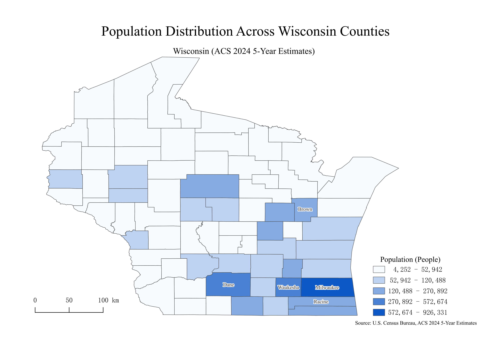
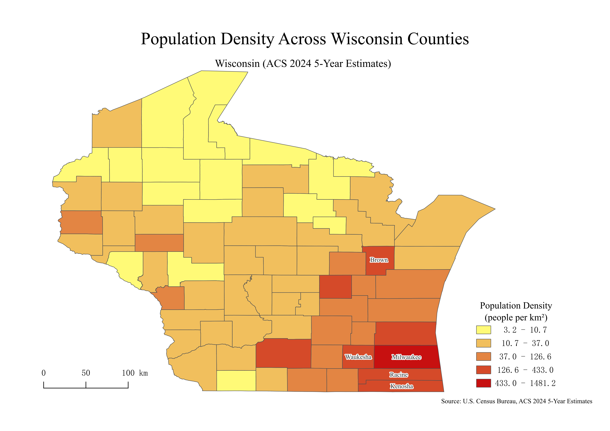

# Wisconsin Demographic Analysis (ACS 2024)

County-level population and population density analysis for the state of Wisconsin using U.S. Census Bureau ACS 2024 5-Year Estimates.

This project demonstrates spatial data processing, attribute joins, derived metric calculation, and cartographic visualization using **QGIS**.

------

## Project Overview

This project analyzes demographic patterns across Wisconsin counties through two thematic maps:

- **Total Population by County**
- **Population Density (people per km²)**

The objective is to transform raw census and geographic boundary data into publication-ready cartographic outputs while applying appropriate spatial classification methods.

------

## Repository Structure

```
│  README.md
│
├─data
│  ├─processed
│  │      wisconsin_counties.gpkg
│  │      wisconsin_population_joined.gpkg
│  │
│  └─raw
│      │  ACSDT5Y2024.B01003.csv
│      │
│      └─tl_2025_us_county
│              tl_2025_us_county.cpg
│              tl_2025_us_county.dbf
│              tl_2025_us_county.prj
│              tl_2025_us_county.shp (126 MB, failed to upload, just ignore it in QGIS)
│              tl_2025_us_county.shp.ea.iso.xml
│              tl_2025_us_county.shp.iso.xml
│              tl_2025_us_county.shx
│
├─output
│      Wisconsin Population 2024.png
│      Wisconsin Population Density 2024.png
│      Wisconsin_Demographic_Analysis_2024.md
│      Wisconsin_Demographic_Analysis_2024.pdf
│
└─project
        Wisconsin_Demographic_Analysis_2024.qgz
```

### Folder Description

- **data/raw/** – Original census and TIGER/Line shapefiles
- **data/processed/** – Cleaned and joined GeoPackage files
- **output/** – Final map exports and report
- **project/** – QGIS project file

------

## Data Sources

- U.S. Census Bureau – ACS 2024 5-Year Estimates
    - Table: B01003 (Total Population)
- TIGER/Line Shapefiles – 2025 County Boundaries

------

## Methodology

### 1. Data Preparation

- Imported county boundary shapefile
- Filtered dataset to include Wisconsin counties only
- Imported ACS population CSV data

### 2. Data Cleaning

- Renamed `B01003_001E` → `Population`
- Verified GEOID consistency
- Removed unused attributes

### 3. Spatial Join

- Joined ACS population table to county geometries via `GEOID`
- Validated successful join in attribute table

### 4. Derived Metric Calculation

Population density was calculated using:

```
Pop_Density = Population / (ALAND / 1,000,000)
```

Where:

- `ALAND` is land area in square meters
- Converted to square kilometers

------

## Map 1 – Total Population

**Classification:** Natural Breaks (Jenks), 5 classes
 **Rationale:** Minimize within-class variance and highlight natural clustering.

### Key Observations

- Southeastern Wisconsin contains the highest population concentrations
- Milwaukee County stands out as the most populated county
- Northern counties show significantly lower population totals
- Strong urban–rural contrast across the state

[Output](output/Wisconsin Population 2024.png):



------

## Map 2 – Population Density

Due to right-skewed distribution, a logarithmic transformation (log10) was applied before classification.

**Classification:** Log transformation + Equal Interval (6 classes)

### Key Observations

- Milwaukee County exhibits the highest density
- Suburban counties show elevated density compared to rural areas
- Northern Wisconsin is sparsely populated
- Density pattern emphasizes metropolitan clustering

[Output](output/Wisconsin Population Density 2024.png):



------

## Cartographic Design Considerations

- Sequential color ramps for quantitative clarity
- Thousand separators for improved legend readability
- Clear title hierarchy and layout balance
- Scale bar and legend positioned for visual harmony
- Source citation included in final exports

------

## Technical Skills Demonstrated

- GIS Data Cleaning & Field Management
- Attribute Table Joins
- Spatial Classification Methods (Jenks, Log Transformation)
- Derived Metric Calculation
- Cartographic Layout Design
- QGIS Project Management
- GeoPackage Data Handling

------

## Future Extensions

- Median household income analysis
- Population growth comparison
- Urban vs rural classification overlay
- Interactive web map deployment

------

## Tools Used

- QGIS 3.40 (OSGeo4W)
- GeoPackage (.gpkg)
- ACS Census Data
- TIGER/Line Shapefiles

------

# Why This Project Matters

This project demonstrates the ability to:

- Transform raw demographic data into spatial insights
- Select appropriate classification strategies for skewed distributions
- Produce publication-ready geographic visualizations

- Structure reproducible GIS workflows
